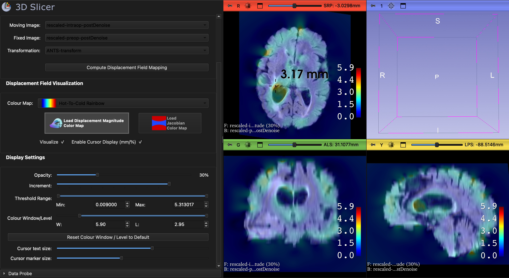
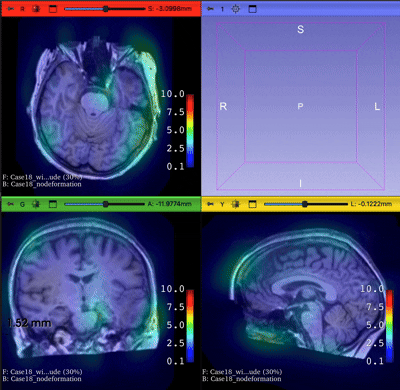

# DeformView

## Overview

**DeformView** provides **intuitive, quantitative visualization of non-linear deformation fields** within the 3D Slicer platform.  
It enables users to interpret deformations using **dense, voxel-wise maps**, given a known transformation and corresponding image data.

DeformView provides two complementary visualization maps:

1. **Displacement Magnitude Map (mm)** – shows local tissue displacement.  
2. **Jacobian Determinant Magnitude (%)** – shows local tissue expansion or compression.

A **real-time cursor display** allows users to hover over any voxel and directly view the corresponding **displacement or Jacobian value**.

---

## Use Cases

DeformView is useful for:

- **Understanding non-linear tissue deformation**
- **Evaluation of image registration algorithms**
- **Research in brain shift modeling**
- **Quantitative interpretation of deformation fields**
- **Comparing preoperative and intraoperative scans**

---

## Panels and Their Use

### Input Selection

- **Moving Image**  
  Image after the transformation has been applied.

- **Fixed Image**  
  Reference image.

- **Transformation**  
  Known transformation between the fixed and moving images.

---

### Compute Displacement Field Mapping

- Computes both:
  - **Dense displacement magnitude volume (mm)**
  - **Dense Jacobian determinant magnitude volume (%)**
- Automatically:
  - Loads the fixed volume into the scene
  - Applies **100% of the transformation**
  - Overlays the corresponding displacement volume

### Increment Slider

  - Controls the **step size** of the applied transformation
  - Allows visualization of **0–100% of the transformation**

  

---

### Color Map / Loading Function

- Switch between:
  - **Displacement volume**
  - **Jacobian volume**
- Reload required to update the color map
- Includes a selection of **intuitive, perceptually meaningful color maps**
- Color maps are:
  - **Editable for the displacement volume**
  - **Fixed for the Jacobian volume** (cannot be changed)

---

### Display Settings

- Adjust **overlay opacity** of the displacement or Jacobian volume

---

## Notes

- A valid transformation must be provided to compute deformation maps.
- Jacobian visualization uses a fixed, scientifically derived color map to preserve interpretability.

